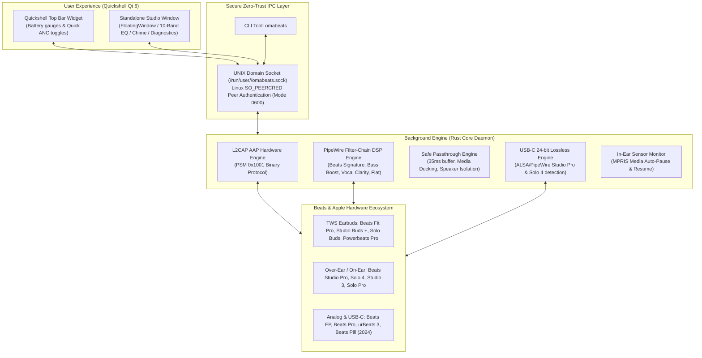

# OmaBeats

**Official Beats Audio Studio & Core System Application for Omarchy Linux**

*Hardware-grade Apple Accessory Protocol (AAP/L2CAP) daemon, multi-model Beats ecosystem manager (35+ models from 2008 to present, plus future-proof inference), Zero-Trust Linux kernel peer credentials (SO_PEERCRED), low-latency PipeWire DSP studio equalizer, USB-C 24-bit Lossless engine, and dual-mode Quickshell UI.*

[English](README.md) • [Türkçe](README.tr.md)

[](LICENSE)
[](https://omarchy.org)
[](Cargo.toml)
[](qml/)
[](CONTRIBUTING.md)
[](https://buymeacoffee.com/ozdil)

---

## Architecture & Principles

OmaBeats operates as a first-class native Omarchy Linux desktop application and background hardware daemon. It directly connects to the Bluetooth L2CAP socket (PSM 0x1001) to communicate via Apple Accessory Protocol (AAP), while managing audio streams and DSP equalizers directly through PipeWire and WirePlumber.



---

## Core Capabilities

### 1. Hardware-Level Apple Accessory Protocol (AAP / L2CAP)
- **Tri-Battery Real-Time Telemetry:** Independent battery percentage and active charging states for Left Earbud, Right Earbud, and Charging Case.
- **Single Battery Telemetry:** Over-Ear, On-Ear, Neckband models and portable speakers.
- **Active Noise Cancellation (ANC):** Seamless switching between Noise Cancellation, Ambient Transparency, Adaptive Mode, and Off.
- **One-Bud ANC:** Hardware override allowing full noise cancellation even when only a single bud is in ear (Apple H1/H2 feature).
- **Optical In-Ear Detection:** Millisecond-accurate sensor reading with native MPRIS / DBus integration for automatic media pause and resume across Spotify, YouTube, and local players.
- **Microphone Routing:** Hardware mic selection between Auto, Always Left, and Always Right.
- **Chime / Find My Sound:** Trigger high-frequency acoustic location beacons independently on Left, Right, or Both earbuds.
- **Hardware Telemetry:** Direct reading of factory Firmware Version and Serial Number.

### 2. Studio-Grade Acoustics & PipeWire DSP Equalizer
- **Native AAC Codec:** Bluetooth transport prioritized on AAC for optimal acoustic fidelity and low power consumption.
- **USB-C 24-bit/48kHz Lossless Audio:** Automatic detection and digital passthrough for Beats Studio Pro, Beats Solo 4, and Beats Pill (2024).
- **Beats DSP Calibrated Profiles:**
  - *Beats Signature:* Sub-bass punch (80Hz +4dB), balanced mids, and crisp highs (6kHz +3dB).
  - *Bass Boost:* Aggressive low-end response (70Hz +6.5dB, 160Hz +3.5dB) for Hip-Hop and EDM.
  - *Vocal Clarity:* High-pass voice emphasis (-4dB @ 100Hz, +5dB @ 3kHz) for podcasts and calls.
  - *Studio Monitor (Flat):* Reference neutral frequency response.
- **Acoustic Passthrough (Transparency):** 35ms safe PipeWire buffer with automatic 50% media ducking and `sink_dont_move=true` hardware lock to completely eliminate speaker feedback loops.

### 3. Zero-Trust Linux Security Standards (HANCORE)
- **Linux Kernel Peer Authentication (`SO_PEERCRED`):** The engine validates the connected process UID on every socket connection. Unauthorized peers are immediately disconnected.
- **Subprocess Isolation:** External calls (`pactl`, `bluetoothctl`, `pw-loopback`) execute in isolated process groups (`process_group(0)`) with monotonic deadlines and RAII `ProcessGroupGuard` cleanup (`SIGTERM` -> 15ms -> `SIGKILL`).
- **Atomic Mode 0600 Storage:** State and cache files are saved atomically using `.tmp_*` files with mode 0600 and directory mode 0700. Symlinks are strictly rejected.
- **Sanitized Execution Environment:** Executable wrapper runs under `/usr/bin/env -i` with strict rejection of `LD_PRELOAD`, `LD_LIBRARY_PATH`, and compiler injection vectors.

---

## Comprehensive Master Catalog (35+ Beats Models)

OmaBeats supports every model produced under the Beats brand, plus automated future-proof inference:

| Category | Supported Models | Primary Connection |
| :--- | :--- | :--- |
| **Wireless Earbuds (TWS)** | Beats Fit Pro, Beats Studio Buds +, Beats Studio Buds, Beats Solo Buds, Powerbeats Pro, Powerbeats Pro 2 | Bluetooth L2CAP (AAP) |
| **Over-Ear & On-Ear** | Beats Studio Pro, Beats Solo 4, Beats Studio 3 Wireless, Beats Solo Pro, Beats Solo 3, Beats Studio 2.0 Wireless, Beats Solo 2 Wireless, Beats Wireless (2012) | Bluetooth L2CAP / USB-C Lossless |
| **Wireless Neckbands** | Beats Flex, BeatsX, Powerbeats (2020), Powerbeats 3, Powerbeats 2 | Bluetooth L2CAP / Classic |
| **Speakers** | Beats Pill (2024), Beats Pill+, Beats Pill 2.0, Beats Pill 1.0, Beats Pill XL | Bluetooth / USB-C Lossless |
| **Analog / Wired Studio** | Beats EP, Beats Pro, Beats Executive, Beats Mixr, Beats Studio 1.0, Beats Studio 2.0 Wired, Beats Solo HD, Beats Solo 2 Wired, urBeats (1/2/3), Beats Tour (1/2), Heartbeats by Lady Gaga, Diddybeats | 3.5mm Analog / DSP Profile |
| **Future Beats Devices** | Dynamic heuristic engine matching Vendor ID `0x004C` or "Beats" naming pattern | Dynamic Capability Deduction |

---

## Installation & Usage

### 1. Installation on Omarchy Linux / Arch Linux

```bash
# Clone the repository
git clone https://github.com/ozdil/omarchy-omabeats.git
cd omarchy-omabeats

# Build and install locally
cargo build --release --locked
mkdir -p ~/.local/bin ~/.local/share/applications
cp omabeats ~/.local/bin/omabeats
cp target/release/omabeats-engine ~/.local/bin/omabeats-engine
cp omabeats.desktop ~/.local/share/applications/omabeats.desktop
update-desktop-database ~/.local/share/applications
```

### 2. Command Line Interface (CLI)

```bash
# Retrieve full status JSON
omabeats status

# Active Noise Cancellation control
omabeats anc noise          # Noise Cancellation
omabeats anc transparency   # Transparency Passthrough
omabeats anc adaptive       # Adaptive Noise Control
omabeats anc off            # Passive mode

# DSP Equalizer Profiles
omabeats eq "Beats Signature"
omabeats eq "Bass Boost"
omabeats eq "Vocal Clarity"
omabeats eq "Flat"

# Microphone routing
omabeats mic auto
omabeats mic left
omabeats mic right

# Acoustic Find My Sound (Chime)
omabeats chime left
omabeats chime right
omabeats chime both

# Wired / Analog Model Acoustic Calibration
omabeats wired beats_ep
omabeats wired beats_pro
omabeats wired reset

# In-Ear Auto-Pause toggle
omabeats auto-pause true
omabeats auto-pause false
```

### 3. Desktop Application & Bar Widget
- Launch from application launcher: Select **OmaBeats** from your desktop menu.
- Launch from terminal: Simply run `omabeats` with no arguments to bring up the standalone Beats Studio window.
- Quickshell Top Bar: Click the OmaBeats icon on your bar to view live battery gauges and quickly toggle listening modes.

---

## Verification & Testing

The codebase includes exhaustive unit and integration test suites:

```bash
# Run all automated tests
cargo test

# Compile optimized release binary
cargo build --release
```

---

## Support & Sponsorship

If you find OmaBeats helpful on Omarchy Linux, support its continuous development:

[](https://buymeacoffee.com/ozdil)

---

## License

MIT License - Copyright (c) 2026 Ozan Özdil (ozdil).
