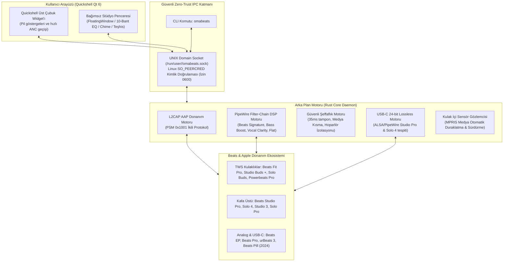

# OmaBeats

**Omarchy Linux Resmi Beats Audio Stüdyosu ve Çekirdek Sistem Uygulaması**

*Donanım seviyesinde Apple Accessory Protocol (AAP/L2CAP) arka plan servisi, 35+ Beats modeli master kataloğu (2008'den günümüze ve geleceğe dönük çıkarım motoru), Linux çekirdeği Zero-Trust kimlik doğrulaması (SO_PEERCRED), düşük gecikmeli PipeWire DSP ekolayzeri, USB-C 24-bit Lossless motoru ve çift modlu Quickshell arayüzü.*

[English](README.md) • [Türkçe](README.tr.md)

[](LICENSE)
[](https://omarchy.org)
[](Cargo.toml)
[](qml/)
[](CONTRIBUTING.md)
[](https://buymeacoffee.com/ozdil)

---

## Mimari ve Temel İlkeler

OmaBeats, Omarchy Linux masaüstü ortamında birinci sınıf yerel masaüstü uygulaması ve donanım yönetim motoru olarak çalışır. Kulaklıkla doğrudan Bluetooth L2CAP soketi (PSM 0x1001) üzerinden Apple Accessory Protocol (AAP) ile haberleşirken, ses akışını ve DSP filtrelerini PipeWire / WirePlumber katmanında yönetir.



---

## Temel Yetenekler

### 1. Donanım Seviyesinde Apple Accessory Protocol (AAP / L2CAP)
- **3'lü Bağımsız Pil Telemetrisi:** Sol Kulaklık, Sağ Kulaklık ve Şarj Kutusu için bağımsız pil yüzdesi ve anlık şarj durumu.
- **Tekil Pil Telemetrisi:** Kafa üstü modeller, boyun askılı kulaklıklar ve taşınabilir hoparlörler için pil takibi.
- **Aktif Gürültü Engelleme (ANC):** Gürültü Engelleme, Şeffaf Mod, Adaptif Mod ve Kapalı arasında donanımsal geçiş.
- **Tek Kulaklıkla ANC (One-Bud ANC):** Yalnızca tek kulaklık takılıyken de gürültü engellemenin aktif kalmasını sağlayan donanım bayrağı (Apple H1/H2).
- **Optik Kulak İçi Algılama:** Milisaniyelik sensör okuması ve yerel MPRIS entegrasyonu sayesinde kulaklık çıkarıldığında Spotify, YouTube ve yerel oynatıcılarda otomatik duraklatma / geri takıldığında sürdürme.
- **Mikrofon Yönlendirme:** Donanımsal mikrofon seçimi: Otomatik, Sabit Sol, Sabit Sağ.
- **Cihazımı Bul (Chime):** Kayıp kulaklığı bulmak için Sol, Sağ veya her iki kulaklıktan bağımsız yüksek frekanslı yer belirleme tonu çaldırma.
- **Donanım Teşhisi:** Donanımdan doğrudan orijinal Firmware sürümü ve Seri Numarası okuma.

### 2. Stüdyo Sınıfı Akustik & PipeWire DSP Ekolayzer
- **Yerel AAC Codec:** Bluetooth aktarımı en yüksek akustik çözünürlük için AAC codec üzerinden önceliklendirilir.
- **USB-C 24-bit/48kHz Kayıpsız (Lossless) Ses:** Beats Studio Pro, Beats Solo 4 ve Beats Pill (2024) USB ile bağlandığında kayıpsız dijital ses otomatik devreye girer.
- **Kalibre Edilmiş Beats DSP Profilleri:**
  - *Beats Signature:* Derin sub-bass vuruşu (80Hz +4dB), dengeli orta frekanslar ve parlak tizler (6kHz +3dB).
  - *Bass Boost:* Hip-Hop ve Elektronik müzikler için agresif bas yanıtı (70Hz +6.5dB, 160Hz +3.5dB).
  - *Vocal Clarity:* Podcast ve sesli aramalar için vokal netliği (-4dB @ 100Hz, +5dB @ 3kHz).
  - *Studio Monitor (Flat):* Referans düz frekans yanıtı.
- **Şeffaf Ortam Geçişi (Transparency):** 35ms güvenli PipeWire gecikme tamponu, müzik çalarken dış konuşmaların duyulması için %50 otomatik medya kısma (ducking) ve sesin dizüstü hoparlörüne kaçıp uğultu yapmasını engelleyen `sink_dont_move=true` donanımsal kilit.

### 3. Zero-Trust Linux Güvenlik Standartları (HANCORE)
- **Linux Çekirdeği Seviyesinde Peer Doğrulaması (`SO_PEERCRED`):** Motora bağlanan her süreç çekirdek seviyesinde taranır; çalışan kullanıcının UID'si ile eşleşmeyen yabancı bağlantılar derhal sonlandırılır.
- **Alt Süreç İzolasyonu:** Harici çağrılar (`pactl`, `bluetoothctl`, `pw-loopback`) bağımsız süreç gruplarında (`process_group(0)`) ve mutlak zaman aşımı (monotonic deadline) ile çalıştırılır; kilitlenen süreçler RAII `ProcessGroupGuard` ile temizlenir.
- **Atomik ve 0600 İzinli Depolama:** Durum verileri `.tmp_*` geçici dosyalarıyla atomik olarak yazılır. Sembolik bağlar (`symlink_metadata`) kesinlikle reddedilir.
- **Steril Çalışma Ortamı:** Yürütücü kabuk sarmalayıcı `/usr/bin/env -i` altında temiz ortamda çalışır; `LD_PRELOAD` ve dinamik bağlayıcı enjeksiyon girişimleri derhal engellenir.

---

## Desteklenen Beats Modelleri Kataloğu (35+ Model)

| Kategori | Desteklenen Modeller | Birincil Bağlantı |
| :--- | :--- | :--- |
| **Kablosuz Kulak İçi (TWS)** | Beats Fit Pro, Beats Studio Buds +, Beats Studio Buds, Beats Solo Buds, Powerbeats Pro, Powerbeats Pro 2 | Bluetooth L2CAP (AAP) |
| **Kafa Üstü & Kulak Üstü** | Beats Studio Pro, Beats Solo 4, Beats Studio 3 Wireless, Beats Solo Pro, Beats Solo 3, Beats Studio 2.0 Wireless, Beats Solo 2 Wireless, Beats Wireless (2012) | Bluetooth L2CAP / USB-C Lossless |
| **Boyun Askılı Kablosuz** | Beats Flex, BeatsX, Powerbeats (2020), Powerbeats 3, Powerbeats 2 | Bluetooth L2CAP / Classic |
| **Taşınabilir Hoparlörler** | Beats Pill (2024), Beats Pill+, Beats Pill 2.0, Beats Pill 1.0, Beats Pill XL | Bluetooth / USB-C Lossless |
| **Kablolu Stüdyo & Klasik** | Beats EP, Beats Pro, Beats Executive, Beats Mixr, Beats Studio 1.0, Beats Studio 2.0 Wired, Beats Solo HD, Beats Solo 2 Wired, urBeats (1/2/3), Beats Tour (1/2), Heartbeats by Lady Gaga, Diddybeats | 3.5mm Analog / DSP Profili |
| **Gelecek Beats Cihazları** | Apple Vendor ID `0x004C` ve "Beats" isim kalıbını eşleştiren sezgisel dinamik çıkarım motoru | Dinamik Yetenek Belirleme |

---

## Kurulum ve Kullanım

### 1. Omarchy Linux / Arch Linux Üzerine Kurulum

```bash
# Depoyu klonlayın
git clone https://github.com/ozdil/omarchy-omabeats.git
cd omarchy-omabeats

# Derleyin ve yerel kullanıcı ortamına kurun
cargo build --release --locked
mkdir -p ~/.local/bin ~/.local/share/applications
cp omabeats ~/.local/bin/omabeats
cp target/release/omabeats-engine ~/.local/bin/omabeats-engine
cp omabeats.desktop ~/.local/share/applications/omabeats.desktop
update-desktop-database ~/.local/share/applications
```

### 2. Komut Satırı Arayüzü (CLI)

```bash
# Donanım durumunu JSON olarak alma
omabeats status

# ANC modunu değiştirme
omabeats anc noise          # Gürültü Engelleme
omabeats anc transparency   # Şeffaf Mod
omabeats anc adaptive       # Adaptif Mod
omabeats anc off            # Kapalı

# DSP Ekolayzer Profilleri
omabeats eq "Beats Signature"
omabeats eq "Bass Boost"
omabeats eq "Vocal Clarity"
omabeats eq "Flat"

# Mikrofon yönlendirme
omabeats mic auto
omabeats mic left
omabeats mic right

# Cihazı Bul Sinyali (Chime)
omabeats chime left
omabeats chime right
omabeats chime both

# Kablolu model akustik telafisi
omabeats wired beats_ep
omabeats wired beats_pro
omabeats wired reset

# Kulak içi otomatik duraklatma ayarı
omabeats auto-pause true
omabeats auto-pause false
```

### 3. Masaüstü Uygulaması ve Çubuk Widget'ı
- Uygulama Başlatıcısı: Masaüstü menünüzden **OmaBeats** seçerek bağımsız stüdyo penceresini açabilirsiniz.
- Terminalden Açılış: Terminalde herhangi bir parametre vermeden `omabeats` çalıştırmak bağımsız stüdyo penceresini (`FloatingWindow`) ekrana getirir.
- Quickshell Üst Çubuğu: Çubuktaki OmaBeats simgesine tıklayarak anlık pil durumunu görebilir ve dinleme modlarını hızla değiştirebilirsiniz.

---

## Doğrulama ve Testler

```bash
# Otomatik birim ve entegrasyon testlerini çalıştırma
cargo test

# Optimize edilmiş sürüm ikili dosyasını derleme
cargo build --release
```

---

## Destek ve Sponsorluk

OmaBeats projesini faydalı buluyorsanız ve gelişimini desteklemek istiyorsanız:

[](https://buymeacoffee.com/ozdil)

---

## Lisans

MIT Lisansı - Telif Hakkı (c) 2026 Ozan Özdil (ozdil).
